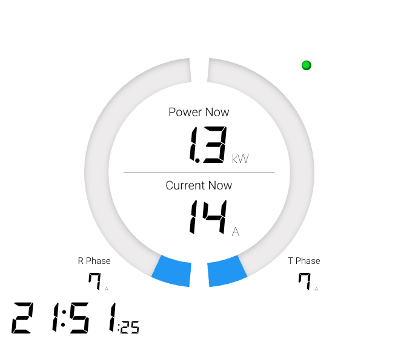

# SmartPower

スマートメータからWi-SUN Bルートで電力量を取得し、現在の電力消費量を表示します。



# 環境変数

- DEVICE_PATH
  - Wi-SUN デバイスへのパスを指定します。`/dev/ttyUSB0` など。
- DEVICE_PASSWORD
  - 電力メーター情報発信サービス（Ｂルートサービス）のパスワードを指定します。
  - パスワードはメールで送られてきています。
- DEVICE_RBID
  -  電力メーター情報発信サービス（Ｂルートサービス）の認証 ID を指定します。
  - 認証 ID は郵便で送られてきています。
- POWER_SOURCE_RATED_COUNT_A
  - 定格電流 (A)
- POWER_SOURCE_WIRE_COUNT
  - 線式 (2 or 3)
- LOG_LEVEL_SK
  - SK のログレベルを指定します。
  - 通常は info で大丈夫ですが、最初は debug をオススメします。 


# 起動

docker-compose.yml の environment を上記説明に従って更新し、以下のコマンドで起動します。

```sh
docker compose up
```

起動後 `http://localhost:8080/` にアクセスするとメーターが表示されます。
